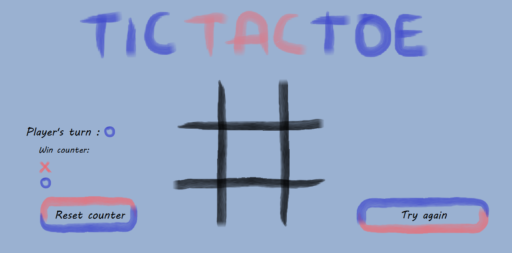
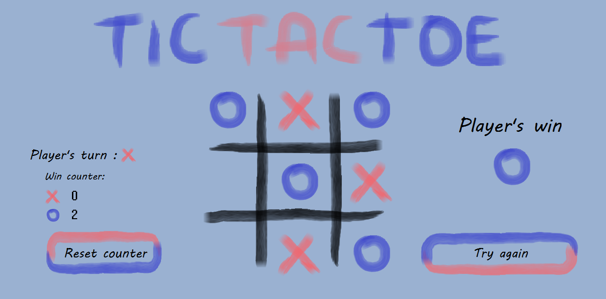

# TicTacToeSH
 This is a simple tic tac toe game.
## Technology 
* C++
## Screenshots

## Setup
To run the project you need the folder 'img' and the file 'TicTacToe.exe' in one folder. Then run the .exe file.
## Usage
The application is used to play with friends the classic version of the game Tic Tac Toe.
## Sources
This app is inspired by 'Pasja informatyki' to the youtebe channel.
